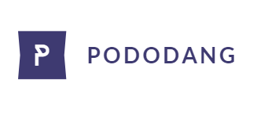

# PODODANG



  

## Getting Started
PODODANG은 PODO.INC 소속으로 이루어진 자기 계발 모임이며, 최신 자바스크립트 동향 및 코드 리뷰 등의 활동을 한다.

### Prerequisites
```
 > git download (latest version download: https://git-scm.com/download/win)

 > install Git-x.x.x-64-bit.exe 

 > join github

 > git config --global user.name "${github user.name}"

 > git config --global user.email "${github user.email}"
 ```

### Install

```
 > git clone https://github.com/ipodo/pododang.git

 > cd pododang

 > git branch #{client-name} (e.g. jooth)

 > git checkout #{client-name} (e.g. jooth)
```

### How to use
[Git 간편 안내서](https://rogerdudler.github.io/git-guide/index.ko.html)


### Contribute

```
 > git push origin ${client-name}
```

## Authors
* jhkim
* jooth
* oykim
* hsyeom
* wblee
* bspark

